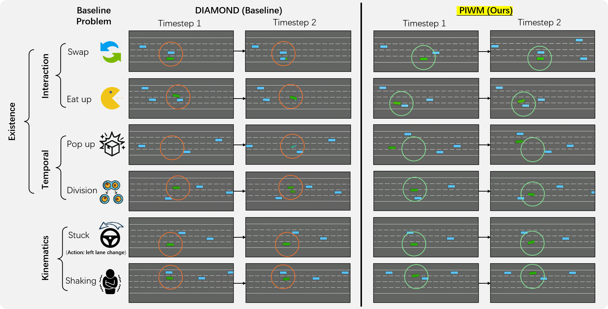

# PIWM: Enhancing Physical Consistency in Lightweight World Models

<div align='center'>

🌍 [Project Page](https://physics-wm.github.io/) • 🤓 [Paper](https://arxiv.org/abs/2509.12437) 



<br/>

</div>

[**TL;DR**] PIWM is a lightweight, physics‑informed generative model that predicts future images from the current image and actions — enabling forecasting with strong existential and temporal consistency in dynamic environments.

The following implementation is based on [DIAMOND](https://github.com/eloialonso/diamond/tree/csgo?tab=readme-ov-file).

## TODO &#128203;<a name="todo"></a>
- [ ] One-page-paper upload (to be done before `[2025/10/30]`)
- [ ] What-is-it video create (to be done before `[2025/10/15]`)
- [x] Dataset release
- [x] Code release
- [x] Preprint release

## Installation
- Quick start with [Miniconda](https://docs.anaconda.com/free/miniconda/miniconda-install/):

    ```bash
    git clone https://github.com/TUM-AVS/physics-wm.git
    cd physics-wm
    conda create -n PIWM python=3.10
    conda activate PIWM
    pip install -r requirements.txt
    ```

- To quickly play with our trained physics‑informed BEV world model (PIWM): the first run will automatically download the pretrained model and several spawn points from the [HuggingFace Hub 🤗](https://huggingface.co/TUM/PIWM_ckpt/tree/main). Please reserve ~1.55GB of disk space. 

    ```bash
    python src/play.py
    ```

When the download completes, press Enter to start. Use WASD and Space to control.

<div align="center">
  <video src="https://github.com/user-attachments/assets/264217a4-4454-40b2-ae65-2c935ccdcf46" width="80%" controls></video>
</div>

- The default fast config runs best on a CUDA GPU (>12 FPS on an RTX 4080 laptop). The model also runs faster if compiled (>21 FPS on an RTX 4080 Laptop).

    ```bash
    python src/play.py --compile
    ```

All demo videos and performance measurements use the [`fast`](config/world_model_env/fast.yaml) config referenced by the [`trainer`](config/trainer.yaml). You can switch to [`higher_quality`](config/world_model_env/higher_quality.yaml) for improved quality at reduced speed.

## Training

We collected 2,000 episodes in HighwayEnv with an MCTS agent, yielding 2 million BEV frames with aligned states and actions as the training dataset.
We used a random test split of 200 episodes of 1000 steps (specified in `test_split.txt`), and the remaining 1,800 episodes for training.

To get the data ready for training on your machine:
- **Step 1**: Download the preprocessed dataset from the [HuggingFace Hub 🤗](https://huggingface.co/datasets/dingrui17/highwayEnv_wm/blob/main/highway_dataset_processed.zip) and unzip it (~550GB disk space).

     Dataset structure:
     ```bash
     your_path/highway_dataset_processed
     ├── full_res
     └── low_res
    ```

- **Step 2**: Then edit [config/env/piwm.yaml](config/env/piwm.yaml) and set:

        `path_data_low_res` to `<your_path>/highway_dataset_processed/low_res`
        `path_data_full_res` to `<your_path>/highway_dataset_processed/full_res`

Then you can launch a training run with

```bash
python src/main.py
```
The provided configuration took around 18 hours on an RTX 4090.


## Advanced

- Adjust Soft Mask related weights used during training and inference in [`piwm.yaml`](config/agent/piwm.yaml).

    Our released model uses:
    - Training:
        ```yaml
        mask_gain_train: 1.0
        
        mask_gain_infer: 0.45       # not used in training
        mask_w_blue: 1.0 
        mask_w_green: 0.8 
        ```
    - Inference:
        ```yaml
        mask_gain_train: 1.0        # not used in inference

        mask_gain_infer: 0.45
        mask_w_blue: 0.55  
        mask_w_green: 0.45        
        ```

- Enable zero-shot Warm Start to inject contextual information at inference time and improve stability for smaller models:

    ```bash
    python src/play.py --warmstart
    ```

## Citation

```text
@misc{anonymous,
        title={Enhancing Physical Consistency in Lightweight World Models}, 
        author={Anonymous Author(s) for now},
        year={2025},
        eprint={2509.12437},
        archivePrefix={arXiv},
        primaryClass={cs.AI},
        url={https://arxiv.org/abs/2509.12437}, 
  }
}
```

## Credits

- [https://github.com/eloialonso/diamond](https://github.com/eloialonso/diamond/tree/csgo?tab=readme-ov-file)
- [https://github.com/Farama-Foundation/HighwayEnv](https://github.com/Farama-Foundation/HighwayEnv)